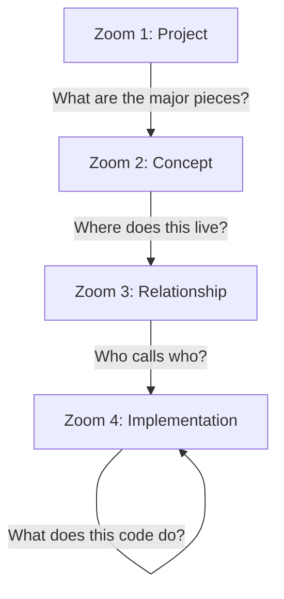
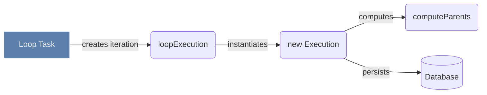

When you open a massive codebase for the first time, the instinct is to open a file and start reading from line 1.

This is like trying to understand a new city using only Google Maps Street View. You see every pebble, but you have no idea what neighborhood you are in.

To actually understand an architecture, you have to shift through four zoom levels. You can't jump straight to the bottom.

Most developers jump straight to **Zoom 4** and try to read 800 lines of code. Everything feels like an incomprehensible microscope.

To fix this, you have to change what you search for.

### Things vs. Actions

In programming (especially in languages like Java or TypeScript), code is split into Things and Actions:

- **"Things" (Nouns)** are usually Classes, Types, or Objects.
  - _Examples:_ `User`, `Server`, `Execution`, `Task`, `Database`.
- **"Actions" (Verbs)** are usually Functions or Methods.
  - _Examples:_ `save()`, `run()`, `delete()`, `calculate()`.

When exploring a massive codebase, you want to start by finding the major **Things** (the Classes) before you look at the **Actions** (the Functions).

If you search for an Action like `save`, you might get 500 results because everything in the system can be saved. But if you search for a Thing like `Execution`, it takes you straight to the core file that defines what an Execution actually is.

### Where do you get your first noun?

How do you search for a concept if you don't know the codebase yet? You pull your first noun from the outside world.

If you are assigned a bug ticket that says: _"The Loop mechanism fails when it processes a Task."_

The "Things" in that sentence are **Loop** and **Task**. Those are the exact words you should search for first.

### The Navigation Drill

Once you have your noun, use your editor to build a map. Do not read the code yet. Follow this strict loop:

**1. Find the Noun (Workspace Symbols)**
Search the entire project for `LoopTask`. Pick the main Class or Type definition and jump to it.

**2. Look at the Menu (Document Symbols)**
You are now in a massive file. Do not read the implementation. Pull up the document symbols to view the file's outline. Scan the properties and methods. You are just checking what data this noun holds and what actions it can perform.

**3. Ask "Who uses this?" (Incoming Calls)**
Find an interesting method in that outline and ask your editor for incoming calls. Instead of reading how the method works, you find out exactly which other components trigger it.

### Building the Graph

By repeating this drill, you stop reading files top-to-bottom. Instead, you build a call graph.

Following the `LoopTask` through its incoming and outgoing calls reveals the exact execution path relevant to your bug:

You trace the system by following its nouns. Find the core object, list its properties, and trace the callers. You build a structural map of the architecture before you read a single line of business logic.
